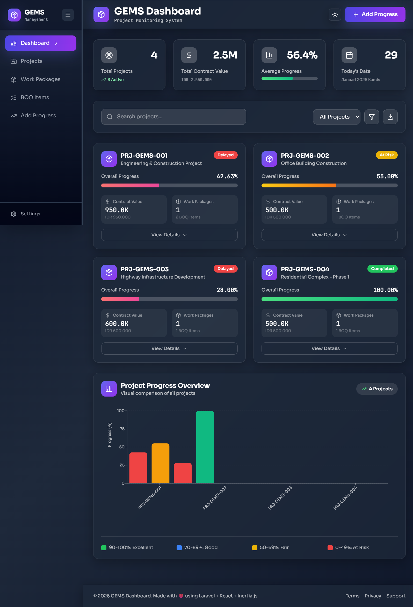
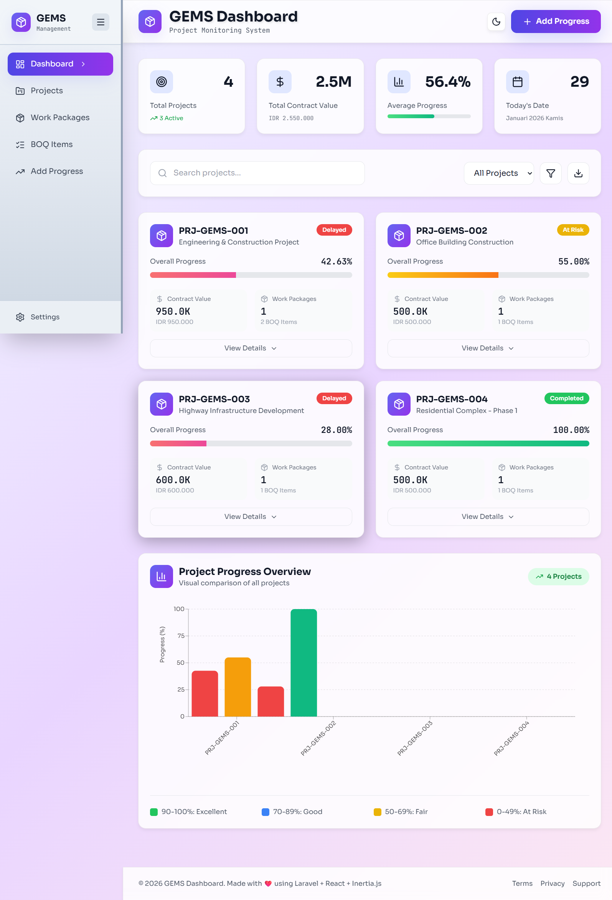
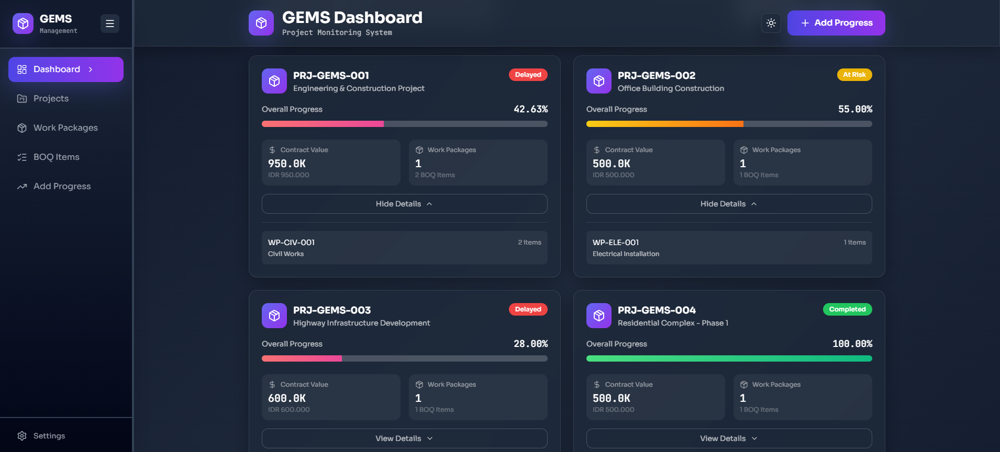
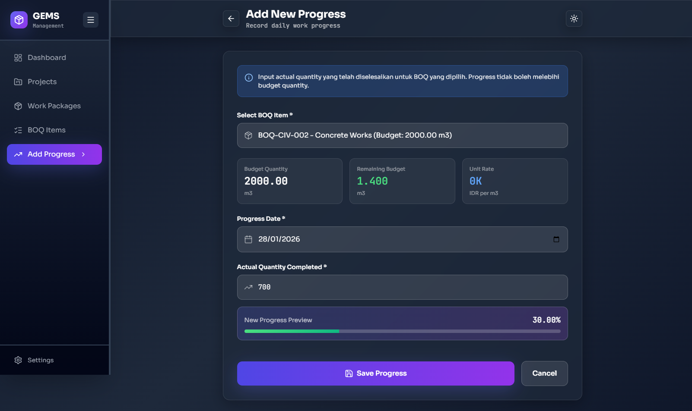
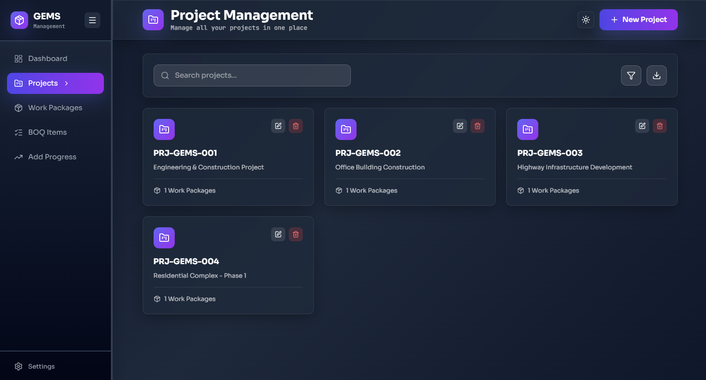
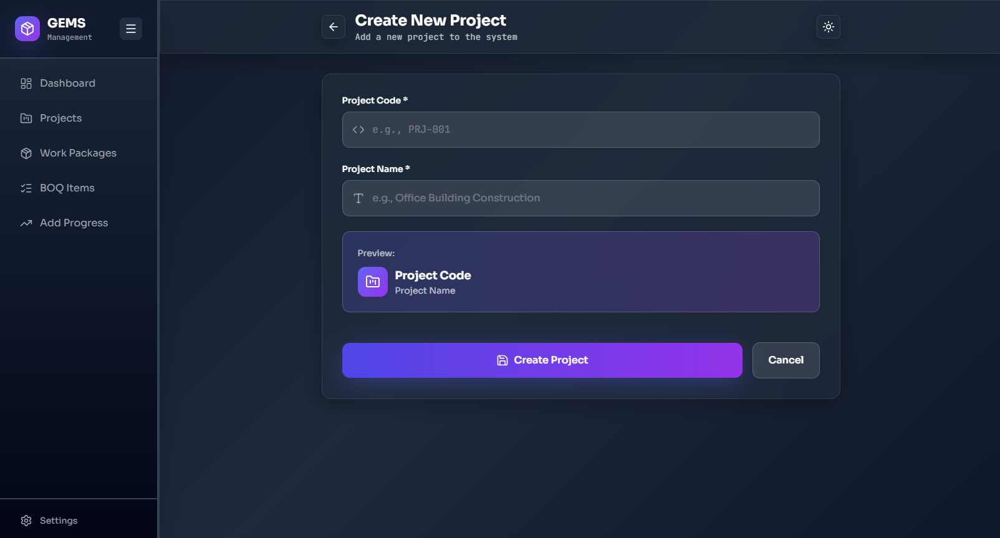
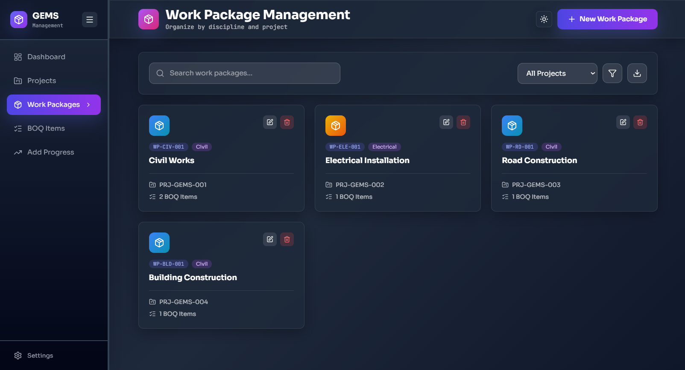
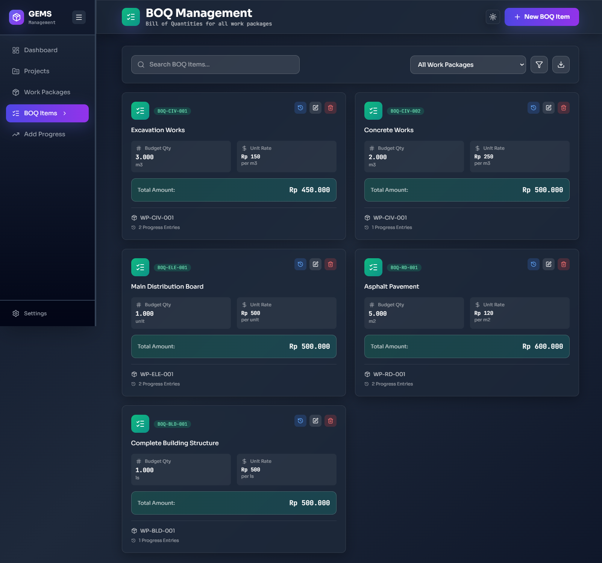

# GEMS - Project Monitoring System

<div align="center">


**Modern project monitoring dashboard dengan BOQ-based Progress tracking**

[Features](#-fitur-utama) • [Screenshots](#-screenshots) • [Installation](#-instalasi) • [Usage](#-cara-penggunaan)

</div>

---

## 📋 Deskripsi

GEMS (General Engineering Monitoring System) adalah aplikasi monitoring progres proyek modern yang dibangun dengan **Laravel 12**, **React 18.3**, dan **Inertia.js 1.3**. Sistem ini menggunakan metode **BOQ-based Progress (Weighted by Cost)** untuk tracking yang akurat dan real-time visualization dengan UI yang stunning menggunakan **Glassmorphism Design** dan **Smooth Animations**.

### 🎯 Metodologi Perhitungan

**BOQ-based Progress (Cost Weighted)**
- Setiap BOQ item dihitung berdasarkan actual quantity vs budget quantity
- Progress Work Package menggunakan bobot biaya (Cost Weighted)
- Overall Project Progress dikalkulasi dari agregasi semua Work Package
- Validasi otomatis untuk mencegah progress melebihi 100%

---

## ✨ Fitur Utama

### 📊 Dashboard Monitoring
- **Real-time Progress Tracking** - Monitor progres proyek secara langsung
- **Interactive Statistics Cards** - Visualisasi KPI dengan animasi smooth
- **Smart Search & Filter** - Temukan proyek dengan cepat
- **Responsive Charts** - Grafik interaktif dengan Recharts
- **Status Indicators** - Color-coded progress (At Risk, In Progress, On Track, Completed)
- **Collapsible Sidebar Navigation** - Modern navigation dengan smooth animations
- **Dark/Light Mode Toggle** - Switch theme dengan satu klik

### 📈 Progress Management
- **BOQ Progress Calculation** - Otomatis menghitung berdasarkan actual vs budget qty
- **Work Package Progress** - Cost-weighted calculation
- **Overall Project Progress** - Agregasi dari semua Work Package
- **Daily Progress Entry** - Form input dengan validasi real-time
- **Progress History with Charts** - Timeline tracking dengan dual-axis interactive charts
- **Progress Preview** - Live preview sebelum submit

### 🎨 User Experience
- **Modern Glassmorphism UI** - Beautiful glass effects dengan backdrop blur
- **Smooth Animations** - Powered by Framer Motion
- **SPA Experience** - No page reloads dengan Inertia.js
- **Dark/Light Theme** - Fully functional theme switcher
- **Smart Value Formatting** - Auto format IDR (K/M/T) dengan 1 desimal

### 🔧 CRUD Management
- **Projects Management** - Create, Read, Update, Delete projects
- **Work Packages Management** - Manage work packages dengan validasi
- **BOQ Items Management** - Complete BOQ management dengan search & filter
- **Progress History View** - Detail progress dengan timeline & charts

### 🔒 Data Validation
- Validasi input progres agar tidak melebihi budget quantity
- Real-time preview sebelum submit
- Error handling yang user-friendly
- Data integrity checks
- Form validation dengan feedback visual

---

## 📸 Screenshots

### 🏠 Dashboard Overview - Dark Mode
*Main dashboard dengan sidebar navigation & glassmorphism UI*



**Highlight pada halaman ini:**
- Sidebar kiri dengan logo GEMS & navigation menu (Dashboard, Projects, Work Packages, BOQ Items, Add Progress, Settings)
- Stats cards (Total Projects, Total Contract Value, Average Progress, Today's Date)
- Search bar & filter dropdown
- Project cards dengan expand/collapse
- Interactive progress chart di bawah
- Footer
- Hamburger button saat sidebar collapsed

---

### 🌞 Dashboard Overview - Light Mode
*Dashboard dalam light mode untuk perbandingan*



**Highlight pada halaman ini:**
- Sidebar tetap kontras (slate-100/200/300) meskipun light mode
- Stats cards dengan background terang
- Project cards dengan shadow & border
- Chart dengan warna yang adjusted
- Overall light theme dengan visibility yang baik

---

### 📦 Project Card - Expanded
*Project card saat di-expand menampilkan work packages*



**Highlight pada halaman ini:**
- Project header dengan code & status badge
- Overall progress bar dengan percentage
- Contract Value dengan format smart (10.6K, 15.4M, 2.5T)
- Work Packages count & BOQ Items count
- Expanded section menampilkan:
  - Work Package cards (WP-CIV-001, WP-CIV-002, dll)
  - BOQ items count per WP
  - Smooth collapse animation

---

### ➕ Add Progress Form
*Form input progress dengan validasi dan preview*



**Highlight pada halaman ini:**
- Sidebar navigation (sama dengan dashboard)
- Page header "Add New Progress" dengan back button & dark mode toggle
- Info banner (blue) dengan instruksi
- BOQ Selection dropdown
- BOQ Details cards (Budget Quantity, Remaining Budget, Unit Rate)
- Progress Date input
- Actual Quantity input
- Progress Preview card dengan animated bar
- Save Progress button & Cancel button

---

### 📊 Projects Management Page
*Halaman CRUD Projects*



**Highlight pada halaman ini:**
- Sidebar navigation
- Page header "Projects Management" dengan "+ Add Project" button
- Search bar & filter
- Table dengan columns: Code, Name, Actions
- Edit & Delete buttons per row
- Pagination (jika ada banyak data)

---

### 📝 Project Form (Create/Edit)
*Form untuk create/edit project*



**Highlight pada halaman ini:**
- Form fields: Project Code, Project Name
- Save & Cancel buttons
- Back button

---

### 📦 Work Packages Management
*Halaman CRUD Work Packages*



**Highlight pada halaman ini:**
- Sidebar navigation
- Page header dengan "+ Add Work Package" button
- Search by project
- Table: WP Code, WP Name, Project, Actions
- Edit & Delete buttons
- Empty state jika tidak ada data

---

### 📋 BOQ Items Management
*Halaman CRUD BOQ Items dengan filter*



**Highlight pada halaman ini:**
- Sidebar navigation
- Page header dengan "+ Add BOQ Item" button
- Search bar & Filter by Work Package dropdown
- Table: BOQ Code, Description, WP, Budget Qty, UOM, Unit Rate, Amount, Progress Entries, Actions
- History icon button (untuk view progress history)
- Delete confirmation modal (jika lagi delete)

---

### 📈 Progress History with Charts
*Detail progress history untuk BOQ item*


**Highlight pada halaman ini:**
- BOQ Information header dengan stats (Budget Qty, Completed Qty, Total Value, Completed Value)
- Interactive Dual-Axis Chart (Progress % & Cumulative Qty) menggunakan Recharts
- Timeline dengan progress entries
- Each entry menampilkan: Date, Actual Qty, Cumulative Qty, Progress %, Amount
- Progress bar per entry
- Latest entry highlighted
- Back to BOQ List button

---

## 🛠️ Tech Stack

### Backend
- **Laravel 12** - PHP Framework
- **Inertia.js 1.3** - Modern monolith
- **MySQL/PostgreSQL** - Database

### Frontend
- **React 18.3** - UI Library
- **Tailwind CSS 3.4** - Styling
- **Framer Motion** - Animations
- **Recharts** - Data visualization
- **Lucide React** - Icons
- **Vite** - Build tool

---

## 📦 Instalasi

### Prerequisites
- PHP >= 8.2
- Composer
- Node.js >= 18
- NPM atau Yarn
- MySQL >= 8.0 atau PostgreSQL

### Step 1: Clone Repository
```bash
git clone https://github.com/carlosmarpaung08/gems-monitoring-system.git
cd gems-app
```

### Step 2: Install Backend Dependencies
```bash
composer install
```

### Step 3: Install Frontend Dependencies
```bash
npm install
```

### Step 4: Environment Setup
```bash
# Copy environment file
cp .env.example .env

# Generate application key
php artisan key:generate

# Configure database di .env
DB_CONNECTION=mysql
DB_HOST=127.0.0.1
DB_PORT=3306
DB_DATABASE=gems_db
DB_USERNAME=root
DB_PASSWORD=your_password
```

### Step 5: Database Migration & Seeding
```bash
# Run migrations
php artisan migrate

# Seed dengan data sample
php artisan db:seed
```

### Step 6: Build Assets & Run
```bash
# Terminal 1 - Build frontend assets (development)
npm run dev

# Terminal 2 - Run Laravel server
php artisan serve
```

### Step 7: Access Application
Buka browser dan akses: **http://localhost:8000**

---

## 🚀 Cara Penggunaan

### 1️⃣ View Dashboard
- Buka halaman utama untuk melihat semua projects
- Toggle sidebar dengan hamburger button
- Switch dark/light mode dengan sun/moon button
- Gunakan search box untuk mencari project tertentu
- Filter berdasarkan status (All, Active, Completed)
- Klik card project untuk expand dan lihat work packages

### 2️⃣ Manage Projects
1. Klik **"Projects"** di sidebar
2. Klik **"+ Add Project"** untuk create
3. Isi form: Code, Name
4. Save untuk simpan data
5. Edit atau Delete dari table actions

### 3️⃣ Manage Work Packages
1. Klik **"Work Packages"** di sidebar
2. Klik **"+ Add Work Package"** 
3. Pilih project, input WP Code & Name
4. Save untuk simpan
5. Edit/Delete dari table

### 4️⃣ Manage BOQ Items
1. Klik **"BOQ Items"** di sidebar
2. Klik **"+ Add BOQ Item"**
3. Pilih Work Package
4. Input: BOQ Code, Description, UOM, Budget Qty, Unit Rate
5. Preview auto-calculation (Qty × Rate)
6. Save untuk simpan

### 5️⃣ Input Progress Harian
1. Klik **"Add Progress"** di sidebar (atau tombol di header)
2. Pilih BOQ item dari dropdown
3. Lihat budget quantity dan remaining budget
4. Input tanggal progress
5. Masukkan actual quantity yang diselesaikan
6. Preview progress baru sebelum submit (dengan animated bar)
7. Klik **"Save Progress"**
8. Success modal muncul dengan animation

### 6️⃣ View Progress History
1. Di BOQ Management, klik icon **History** pada BOQ item
2. Lihat BOQ Information stats
3. Analyze interactive dual-axis chart (Progress % & Cumulative Qty)
4. Scroll timeline untuk lihat semua entries
5. Hover chart untuk detail tooltip

### 7️⃣ Analisis Data
- Gunakan interactive charts untuk comparison
- Monitor status indicators (color-coded)
- Track contract value dengan smart formatting (K/M/T)
- Analyze work package performance
- Review progress trends dari chart

---

## 📁 Struktur Project

```
gems-app/
├── app/
│   ├── Http/
│   │   └── Controllers/
│   │       ├── ProjectManagementController.php  # CRUD Projects, WP, BOQ
│   │       └── ProjectController.php            # Dashboard & Progress
│   └── Models/
│       ├── Project.php                          # Model Project
│       ├── WorkPackage.php                      # Model Work Package
│       ├── Boq.php                              # Model BOQ
│       └── ProgressEntry.php                    # Model Progress Entry
│
├── database/
│   ├── migrations/                              # Database schema
│   └── seeders/
│       └── ProjectSeeder.php                    # Sample data
│
├── resources/
│   ├── js/
│   │   ├── Pages/
│   │   │   ├── ProjectDashboard.jsx             # Main dashboard
│   │   │   ├── CreateProgress.jsx               # Progress form
│   │   │   └── Management/                      # CRUD Pages
│   │   │       ├── ProjectList.jsx              # Projects management
│   │   │       ├── ProjectForm.jsx              # Project create/edit
│   │   │       ├── WorkPackageList.jsx          # WP management
│   │   │       ├── WorkPackageForm.jsx          # WP create/edit
│   │   │       ├── BoqList.jsx                  # BOQ management
│   │   │       ├── BoqForm.jsx                  # BOQ create/edit
│   │   │       └── ProgressHistory.jsx          # Progress history with chart
│   │   ├── Components/
│   │   │   ├── Layout.jsx                       # Sidebar layout wrapper
│   │   │   ├── ProjectCard.jsx                  # Project card component
│   │   │   └── ProgressChart.jsx                # Dashboard chart
│   │   ├── app.jsx                              # React entry point
│   │   └── bootstrap.js
│   ├── css/
│   │   └── app.css                              # Global styles + glassmorphism
│   └── views/
│       └── app.blade.php                        # Root template
│
├── routes/
│   └── web.php                                  # Application routes
│
├── vite.config.js                               # Vite configuration
├── tailwind.config.js                           # Tailwind configuration
└── package.json                                 # NPM dependencies
```

---

## 🔢 Business Logic

### Progress Calculation Flow

```
1. BOQ Progress (%)
   = (Actual Qty / Budget Qty) × 100
   
2. BOQ Amount
   = Budget Qty × Unit Rate
   
3. Work Package Progress (%) - Cost Weighted
   = Σ(BOQ Progress × BOQ Amount) / Σ(BOQ Amount) × 100
   
4. Overall Project Progress (%)
   = Σ(WP Progress × WP Amount) / Σ(WP Amount) × 100
```

### Smart Value Formatting
```javascript
// Auto format ke K/M/T dengan 1 desimal
value >= 1,000,000,000 → X.XT (Triliun)
value >= 1,000,000     → X.XM (Juta)
value >= 1,000         → X.XK (Ribu)

// Contoh:
10,600         → 10.6K
15,400,000     → 15.4M
2,560,000,000  → 2.6T
```

### Data Validation Rules
- `actual_qty` tidak boleh menyebabkan total progress > `budget_qty`
- Progress percentage otomatis capped di 100%
- Tanggal progress wajib diisi
- BOQ selection wajib valid
- All numeric fields validated
- Unique constraints pada codes

---

## 🎨 Customization

### Change Theme Colors
Edit `resources/css/app.css`:
```css
:root {
    --color-primary: #6366f1;     /* Indigo */
    --color-secondary: #8b5cf6;   /* Purple */
    --color-accent: #ec4899;      /* Pink */
    --color-success: #10b981;     /* Green */
    --color-warning: #f59e0b;     /* Orange */
    --color-danger: #ef4444;      /* Red */
}
```

### Change Fonts
Update `resources/views/app.blade.php` dan `tailwind.config.js`:
```javascript
// tailwind.config.js
fontFamily: {
    sans: ['Your Font', 'sans-serif'],
    mono: ['Your Mono Font', 'monospace'],
}
```

### Modify Glassmorphism Effect
Edit `.glass-effect` class in `resources/css/app.css`:
```css
.glass-effect {
    background: rgba(255, 255, 255, 0.1);
    backdrop-filter: blur(10px);
    border: 1px solid rgba(255, 255, 255, 0.2);
}
```

### Customize Sidebar
Edit `resources/js/Components/Layout.jsx`:
- Change sidebar width (default: `w-64`)
- Modify navigation items
- Adjust colors for light/dark mode
- Change animation timing

---

## 🚀 Production Deployment

### Build for Production
```bash
# Build optimized assets
npm run build

# Optimize Laravel
php artisan config:cache
php artisan route:cache
php artisan view:cache
php artisan optimize
```

### Environment Setup
```bash
# Set production environment
APP_ENV=production
APP_DEBUG=false
APP_URL=https://yourdomain.com

# Set secure app key
php artisan key:generate
```

### Server Requirements
- PHP 8.2+
- Composer
- MySQL 8.0+ / PostgreSQL
- Nginx/Apache with URL rewriting
- SSL Certificate (recommended)
- Node.js (for initial build only)

### Nginx Configuration Example
```nginx
server {
    listen 80;
    server_name yourdomain.com;
    root /var/www/gems-app/public;

    add_header X-Frame-Options "SAMEORIGIN";
    add_header X-Content-Type-Options "nosniff";

    index index.php;

    charset utf-8;

    location / {
        try_files $uri $uri/ /index.php?$query_string;
    }

    location = /favicon.ico { access_log off; log_not_found off; }
    location = /robots.txt  { access_log off; log_not_found off; }

    error_page 404 /index.php;

    location ~ \.php$ {
        fastcgi_pass unix:/var/run/php/php8.2-fpm.sock;
        fastcgi_param SCRIPT_FILENAME $realpath_root$fastcgi_script_name;
        include fastcgi_params;
    }

    location ~ /\.(?!well-known).* {
        deny all;
    }
}
```

---

## 🐛 Troubleshooting

### Common Issues

**1. Blank page atau white screen**
```bash
# Clear all caches
php artisan cache:clear
php artisan config:clear
php artisan view:clear
php artisan route:clear

# Rebuild assets
npm run build
```

**2. Vite manifest not found**
```bash
# Make sure Vite is running for development
npm run dev

# Or build for production
npm run build
```

**3. Database connection error**
- Check `.env` database credentials
- Ensure database exists: `CREATE DATABASE gems_db;`
- Verify MySQL/PostgreSQL is running
- Test connection: `php artisan migrate:status`

**4. NPM errors**
```bash
# Clear node_modules and reinstall
rm -rf node_modules package-lock.json
npm install
```

**5. Permission denied errors**
```bash
# Fix Laravel permissions (Linux/Mac)
chmod -R 775 storage bootstrap/cache
chown -R www-data:www-data storage bootstrap/cache

# Windows
# Ensure your user has full control of these folders
```

**6. Sidebar tidak muncul atau hamburger tidak work**
- Check browser console for JS errors
- Verify Layout.jsx is imported correctly
- Ensure darkMode prop is passed to Layout
- Clear browser cache

**7. Charts tidak muncul**
- Verify Recharts is installed: `npm list recharts`
- Check data structure passed to charts
- Open browser console for errors

**8. Progress calculation salah**
- Verify database relations: `Project → WorkPackage → Boq → ProgressEntry`
- Check seeder data integrity
- Ensure `withCount()` is used in Controller queries

---

## 📚 API Routes Documentation

### Dashboard & Progress
```
GET  /                      → ProjectDashboard (with sidebar)
GET  /progress/create       → CreateProgress form (with sidebar)
POST /progress              → Store new progress entry
```

### Projects Management
```
GET    /projects/manage        → ProjectList (table view)
GET    /projects/create        → ProjectForm (create)
POST   /projects               → Store new project
GET    /projects/{id}/edit     → ProjectForm (edit)
PUT    /projects/{id}          → Update project
DELETE /projects/{id}          → Delete project
```

### Work Packages Management
```
GET    /workpackages/manage       → WorkPackageList
GET    /workpackages/create       → WorkPackageForm (create)
POST   /workpackages              → Store new WP
GET    /workpackages/{id}/edit    → WorkPackageForm (edit)
PUT    /workpackages/{id}         → Update WP
DELETE /workpackages/{id}         → Delete WP
```

### BOQ Items Management
```
GET    /boqs/manage           → BoqList (with filter)
GET    /boqs/create           → BoqForm (create)
POST   /boqs                  → Store new BOQ
GET    /boqs/{id}/edit        → BoqForm (edit)
PUT    /boqs/{id}             → Update BOQ
DELETE /boqs/{id}             → Delete BOQ
GET    /boqs/{id}/history     → ProgressHistory (with chart)
```

### Models Relationships
```
Project
  └── hasMany → WorkPackage
        └── hasMany → Boq
              └── hasMany → ProgressEntry

// Eager loading example
$projects = Project::with([
    'workPackages.boqItems.progressEntries'
])->withCount('boqItems')->get();
```

---

## 🎓 Learning Resources

### Key Technologies
- **Laravel 12**: [Laravel Documentation](https://laravel.com/docs/12.x)
- **Inertia.js 1.3**: [Inertia.js Docs](https://inertiajs.com)
- **React 18.3**: [React Official Docs](https://react.dev)
- **Tailwind 3.4**: [Tailwind CSS Docs](https://tailwindcss.com/docs)
- **Framer Motion**: [Motion Docs](https://www.framer.com/motion/)
- **Recharts**: [Recharts Guide](https://recharts.org/en-US/)

### Concepts Covered
- SPA with Inertia.js (no API needed)
- Component-based UI with React
- Utility-first CSS with Tailwind
- Glassmorphism design patterns
- Animation with Framer Motion
- Data visualization with Recharts
- Form handling & validation
- CRUD operations
- Eloquent relationships
- Cost-weighted progress calculation

---

## 🤝 Contributing

Contributions are welcome! Please follow these steps:

1. Fork the repository
2. Create feature branch (`git checkout -b feature/AmazingFeature`)
3. Commit changes (`git commit -m 'Add some AmazingFeature'`)
4. Push to branch (`git push origin feature/AmazingFeature`)
5. Open Pull Request

### Contribution Guidelines
- Follow PSR-12 coding standards for PHP
- Use ESLint rules for JavaScript/React
- Write descriptive commit messages
- Add comments for complex logic
- Update documentation if needed
- Test thoroughly before PR

---

## 📝 License

This project is licensed under the MIT License - see the [LICENSE](LICENSE) file for details.

---

## 👨‍💻 Developer

**Carlos Michael Marpaung**
- GitHub: [@carlosmarpaung08](https://github.com/carlosmarpaung08)
- Email: calmrp1412@gmail.com
- LinkedIn: [Carlos Michael Marpaung](https://linkedin.com/in/carlosmarpaung)

---

## 🙏 Acknowledgments

Built with amazing technologies:
- [Laravel 12](https://laravel.com) - PHP Framework
- [React 18.3](https://react.dev) - UI Library
- [Inertia.js 1.3](https://inertiajs.com) - Modern Monolith
- [Tailwind CSS 3.4](https://tailwindcss.com) - Styling
- [Framer Motion](https://www.framer.com/motion) - Animations
- [Recharts](https://recharts.org) - Charts Library
- [Lucide](https://lucide.dev) - Beautiful Icons

Special thanks to:
- Anthropic Claude for development assistance
- Open source community
- Laravel & React communities

---

## 📞 Support

Jika ada pertanyaan atau issue:
1. Check [Troubleshooting](#-troubleshooting) section
2. Search existing GitHub issues
3. Open a new issue with detailed description
4. Contact developer via email

**Response Time**: Usually within 24-48 hours

---

## 🗺️ Roadmap

Future enhancements planned:
- [ ] Export reports to PDF/Excel
- [ ] Email notifications for progress updates
- [ ] User roles & permissions
- [ ] Multi-project comparison dashboard
- [ ] Advanced analytics & forecasting
- [ ] Mobile app (React Native)
- [ ] API endpoints for third-party integrations
- [ ] Real-time collaboration features
- [ ] Document management system
- [ ] Gantt chart view for projects

---

<div align="center">

**⭐ Star this repo if you find it helpful! ⭐**

Made with ❤️ using Laravel 12 + React 18.3 + Inertia.js 1.3

[Back to Top](#gems---project-monitoring-system)

</div>