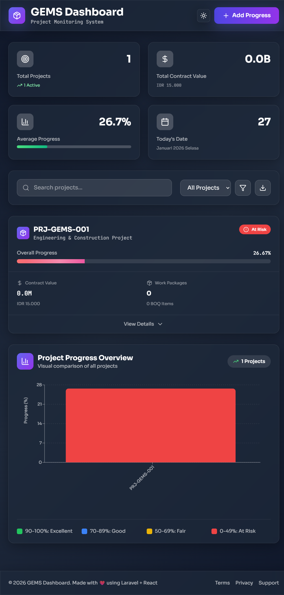

# GEMS - Project Monitoring System

<div align="center">


**Modern project monitoring dashboard dengan BOQ-based Progress tracking**

[Features](#-fitur-utama) • [Screenshots](#-screenshots) • [Installation](#-instalasi) • [Usage](#-cara-penggunaan)

</div>

---

## 📋 Deskripsi

GEMS (General Engineering Monitoring System) adalah aplikasi monitoring progres proyek modern yang dibangun dengan **Laravel**, **React**, dan **Inertia.js**. Sistem ini menggunakan metode **BOQ-based Progress (Weighted by Cost)** untuk tracking yang akurat dan real-time visualization.

### 🎯 Metodologi Perhitungan

**BOQ-based Progress (Cost Weighted)**
- Setiap BOQ item dihitung berdasarkan actual quantity vs budget quantity
- Progress Work Package menggunakan bobot biaya (Cost Weighted)
- Overall Project Progress dikalkulasi dari agregasi semua Work Package
- Validasi otomatis untuk mencegah progress melebihi 100%

---

## ✨ Fitur Utama

### 📊 Dashboard Monitoring
- **Real-time Progress Tracking** - Monitor progres proyek secara langsung
- **Interactive Statistics Cards** - Visualisasi KPI dengan animasi smooth
- **Smart Search & Filter** - Temukan proyek dengan cepat
- **Responsive Charts** - Grafik interaktif dengan Recharts
- **Status Indicators** - Color-coded progress (At Risk, In Progress, On Track, Completed)

### 📈 Progress Management
- **BOQ Progress Calculation** - Otomatis menghitung berdasarkan actual vs budget qty
- **Work Package Progress** - Cost-weighted calculation
- **Overall Project Progress** - Agregasi dari semua Work Package
- **Daily Progress Entry** - Form input dengan validasi real-time
- **Progress History** - Tracking semua entry progres

### 🎨 User Experience
- **Modern Glassmorphism UI** - Beautiful glass effects dengan backdrop blur
- **Smooth Animations** - Powered by Framer Motion
- **SPA Experience** - No page reloads dengan Inertia.js
- **Mobile Responsive** - Perfect di semua devices
- **Dark/Light Theme Ready** - Customizable theme

### 🔒 Data Validation
- Validasi input progres agar tidak melebihi budget quantity
- Real-time preview sebelum submit
- Error handling yang user-friendly
- Data integrity checks

---

## 📸 Screenshots

### 🏠 Dashboard Overview
*Fullsize dashboard view menampilkan semua fitur utama*



**Yang terlihat dalam screenshot:**

**📊 Top Section - Statistics Cards:**
- Total Projects dengan jumlah active projects
- Total Contract Value dalam Rupiah
- Average Progress dengan progress bar
- Today's Date dengan tanggal lengkap

**🔍 Middle Section - Search & Filter:**
- Real-time search box untuk cari projects
- Filter dropdown (All, Active, Completed)
- Quick action buttons (Filter, Download)

**📦 Project Cards - Expandable:**
- Project header dengan code & name
- Status badge (At Risk, In Progress, On Track, Completed) dengan color coding
- Animated progress bar dengan percentage
- Contract value dan work package count
- Expand/collapse untuk lihat details
- **Saat di-expand menampilkan:**
  - Work Package breakdown dengan progress
  - BOQ items table lengkap (Code, Description, Budget, Actual, Progress, Amount)
  - Cost-weighted calculations
  - Mini progress bars per BOQ item

**📈 Bottom Section - Interactive Charts:**
- Bar chart comparison antar projects
- Color-coded bars (red/yellow/blue/green) berdasarkan progress
- Interactive tooltips saat hover
- Legend indicators (90-100%: Excellent, 70-89%: Good, dst)
- X-axis dengan project codes
- Y-axis dengan progress percentage

**🎨 Design Elements:**
- Glassmorphism effects dengan backdrop blur
- Gradient backgrounds (purple to pink)
- Smooth animations dan transitions
- Responsive layout
- Professional color scheme

---

### ➕ Add Progress Form
*Form input progress dengan validasi dan preview*


**Features:**
- BOQ selection dropdown dengan full details
- Budget Quantity, Remaining Budget, dan Unit Rate cards
- Date picker untuk progress date
- Actual Quantity input dengan validation
- Real-time progress preview dengan animated bar
- Success animation setelah submit
- Error handling yang user-friendly

---

## 🛠️ Tech Stack

### Backend
- **Laravel 11** - PHP Framework
- **Inertia.js** - Modern monolith
- **MySQL/PostgreSQL** - Database

### Frontend
- **React 18** - UI Library
- **Tailwind CSS 3** - Styling
- **Framer Motion** - Animations
- **Recharts** - Data visualization
- **Lucide React** - Icons
- **Vite** - Build tool

---

## 📦 Instalasi

### Prerequisites
- PHP >= 8.1
- Composer
- Node.js >= 18
- NPM atau Yarn
- MySQL >= 8.0 atau PostgreSQL

### Step 1: Clone Repository
```bash
git clone https://github.com/carlosmarpaung08/gems-monitoring-system.git
cd gems-app
```

### Step 2: Install Backend Dependencies
```bash
composer install
```

### Step 3: Install Frontend Dependencies
```bash
npm install
```

### Step 4: Environment Setup
```bash
# Copy environment file
cp .env.example .env

# Generate application key
php artisan key:generate

# Configure database di .env
DB_CONNECTION=mysql
DB_HOST=127.0.0.1
DB_PORT=3306
DB_DATABASE=gems_db
DB_USERNAME=root
DB_PASSWORD=your_password
```

### Step 5: Database Migration & Seeding
```bash
# Run migrations
php artisan migrate

# Seed dengan data sample
php artisan db:seed
```

### Step 6: Build Assets & Run
```bash
# Terminal 1 - Build frontend assets (development)
npm run dev

# Terminal 2 - Run Laravel server
php artisan serve
```

### Step 7: Access Application
Buka browser dan akses: **http://localhost:8000**

---

## 🚀 Cara Penggunaan

### 1️⃣ View Dashboard
- Buka halaman utama untuk melihat semua projects
- Gunakan search box untuk mencari project tertentu
- Filter berdasarkan status (All, Active, Completed)
- Klik card project untuk expand dan lihat details

### 2️⃣ Monitor Progress
- Lihat statistics cards untuk overview cepat
- Check progress bars untuk setiap project
- Expand project cards untuk lihat Work Package details
- Review BOQ items dan actual progress

### 3️⃣ Input Progress Harian
1. Klik tombol **"+ Add Progress"** di header
2. Pilih BOQ item dari dropdown
3. Lihat budget quantity dan remaining budget
4. Input tanggal progress
5. Masukkan actual quantity yang diselesaikan
6. Preview progress baru sebelum submit
7. Klik **"Save Progress"**

### 4️⃣ Analisis Data
- Gunakan interactive charts untuk comparison
- Monitor status indicators (color-coded)
- Track contract value dan spending
- Analyze work package performance

---

## 📁 Struktur Project

```
gems-app/
├── app/
│   ├── Http/
│   │   └── Controllers/
│   │       └── ProjectController.php    # Controller dengan Inertia
│   └── Models/
│       ├── Project.php                  # Model Project
│       ├── WorkPackage.php              # Model Work Package
│       ├── Boq.php                      # Model BOQ
│       └── ProgressEntry.php            # Model Progress Entry
│
├── database/
│   ├── migrations/                      # Database schema
│   └── seeders/
│       └── ProjectSeeder.php           # Sample data
│
├── resources/
│   ├── js/
│   │   ├── Pages/
│   │   │   ├── ProjectDashboard.jsx     # Main dashboard
│   │   │   └── CreateProgress.jsx       # Progress form
│   │   ├── Components/
│   │   │   ├── ProjectCard.jsx          # Project card
│   │   │   ├── WorkPackageTable.jsx     # WP table
│   │   │   └── ProgressChart.jsx        # Chart component
│   │   ├── app.jsx                      # React entry point
│   │   └── bootstrap.js
│   ├── css/
│   │   └── app.css                      # Global styles
│   └── views/
│       └── app.blade.php                # Root template
│
├── routes/
│   └── web.php                          # Application routes
│
├── vite.config.js                       # Vite configuration
├── tailwind.config.js                   # Tailwind configuration
└── package.json                         # NPM dependencies
```

---

## 🔢 Business Logic

### Progress Calculation Flow

```
1. BOQ Progress (%)
   = (Actual Qty / Budget Qty) × 100
   
2. BOQ Amount
   = Budget Qty × Unit Rate
   
3. Work Package Progress (%) - Cost Weighted
   = Σ(BOQ Progress × BOQ Amount) / Σ(BOQ Amount) × 100
   
4. Overall Project Progress (%)
   = Σ(WP Progress × WP Amount) / Σ(WP Amount) × 100
```

### Data Validation Rules
- `actual_qty` tidak boleh menyebabkan total progress > `budget_qty`
- Progress percentage otomatis capped di 100%
- Tanggal progress wajib diisi
- BOQ selection wajib valid

---

## 🎨 Customization

### Change Theme Colors
Edit `resources/css/app.css`:
```css
:root {
    --color-primary: #6366f1;     /* Indigo */
    --color-secondary: #8b5cf6;   /* Purple */
    --color-accent: #ec4899;      /* Pink */
    --color-success: #10b981;     /* Green */
    --color-warning: #f59e0b;     /* Orange */
    --color-danger: #ef4444;      /* Red */
}
```

### Change Fonts
Update `resources/views/app.blade.php` dan `tailwind.config.js`:
```javascript
// tailwind.config.js
fontFamily: {
    sans: ['Your Font', 'sans-serif'],
    mono: ['Your Mono Font', 'monospace'],
}
```

### Modify Animations
Edit animations in `resources/css/app.css` atau component files.

---

## 🚀 Production Deployment

### Build for Production
```bash
# Build optimized assets
npm run build

# Optimize Laravel
php artisan config:cache
php artisan route:cache
php artisan view:cache
```

### Environment Setup
```bash
# Set production environment
APP_ENV=production
APP_DEBUG=false

# Set secure app key
php artisan key:generate
```

### Server Requirements
- PHP 8.1+
- Composer
- MySQL/PostgreSQL
- Nginx/Apache
- SSL Certificate (recommended)

---

## 🐛 Troubleshooting

### Common Issues

**1. Blank page atau white screen**
```bash
# Clear all caches
php artisan cache:clear
php artisan config:clear
php artisan view:clear

# Rebuild assets
npm run build
```

**2. Vite manifest not found**
```bash
# Make sure Vite is running
npm run dev

# Or build for production
npm run build
```

**3. Database connection error**
- Check `.env` database credentials
- Ensure database exists
- Verify MySQL/PostgreSQL is running

**4. NPM errors**
```bash
# Clear node_modules and reinstall
rm -rf node_modules package-lock.json
npm install
```

**5. Permission denied errors**
```bash
# Fix Laravel permissions
chmod -R 775 storage bootstrap/cache
```

---

## 📚 Documentation

### API Endpoints
- `GET /` - Dashboard utama
- `GET /progress/create` - Form tambah progress
- `POST /progress` - Submit progress baru

### Models Relationships
```
Project
  └── hasMany → WorkPackage
        └── hasMany → Boq
              └── hasMany → ProgressEntry
```

### Key Components
- **ProjectDashboard.jsx** - Main dashboard dengan stats & projects
- **CreateProgress.jsx** - Form input progress
- **ProjectCard.jsx** - Individual project card
- **WorkPackageTable.jsx** - Table WP & BOQ details
- **ProgressChart.jsx** - Recharts visualization

---

## 🤝 Contributing

Contributions are welcome! Please follow these steps:

1. Fork the repository
2. Create feature branch (`git checkout -b feature/AmazingFeature`)
3. Commit changes (`git commit -m 'Add some AmazingFeature'`)
4. Push to branch (`git push origin feature/AmazingFeature`)
5. Open Pull Request

---

## 📝 License

This project is licensed under the MIT License - see the [LICENSE](LICENSE) file for details.

---

## 👨‍💻 Developer

**Carlos Michael Marpaung**
- GitHub: @carlosmarpaung08
- Email: calmrp1412@gmail.com

---

## 🙏 Acknowledgments

Built with amazing technologies:
- [Laravel](https://laravel.com) - PHP Framework
- [React](https://react.dev) - UI Library
- [Inertia.js](https://inertiajs.com) - Modern Monolith
- [Tailwind CSS](https://tailwindcss.com) - Styling
- [Framer Motion](https://www.framer.com/motion) - Animations
- [Recharts](https://recharts.org) - Charts
- [Lucide](https://lucide.dev) - Icons

---

## 📞 Support

Jika ada pertanyaan atau issue:
1. Check [Troubleshooting](#-troubleshooting) section
2. Open an issue on GitHub
3. Contact developer

---

<div align="center">

**⭐ Star this repo if you find it helpful! ⭐**

Made with ❤️ using Laravel + React + Inertia.js

</div>
